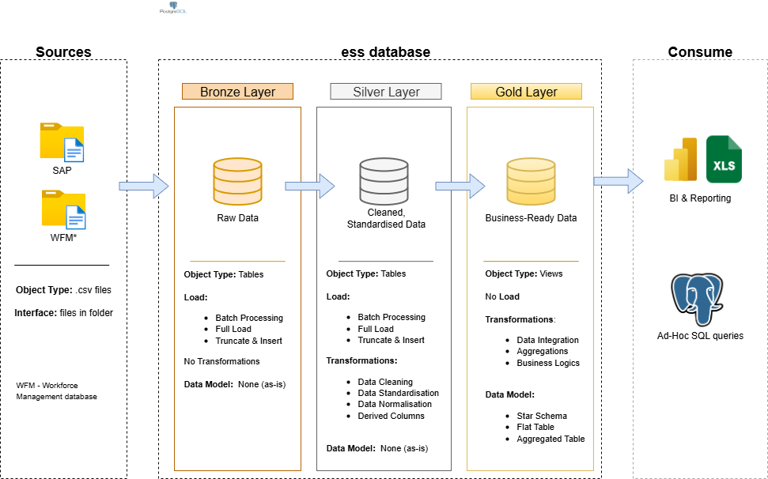

 # ess Database Project

This portfolio project showcases a comprehensive database solution designed for analytics, from structured data modeling to generating actionable insights. It follows industry best practices in data engineering, including the use of the Medallion architecture and star schema design.

---
## 🏗️ Data Architecture

The data architecture for this project follows Medallion Architecture **Bronze**, **Silver**, and **Gold** layers:


1. **Bronze Layer**: Stores raw data from the source systems. Data is loaded from .csv files into PostgreSQL database using '/copy' command in pgAdmin4.
2. **Silver Layer**: This layer includes data cleansing, standardization, and normalization processes to prepare data for analysis.
3. **Gold Layer**: Contains business-ready data structured in a star schema to support reporting and analytics.

---
## 📖 Project Overview

This project involves:

1. **Data Architecture**: Designing a modern database architecture based on the Medallion model, incorporating **Bronze**, **Silver**, and **Gold** layers.
2. **ETL Pipelines**: Extracting, transforming, and loading data from source systems into a centralized database for analysis and reporting.
3. **Data Modeling**: Developing fact and dimension tables designed for efficient analytical querying within a star schema.
4. **Analytics & Reporting**: Creating SQL-based reports and dashboards to deliver actionable business insights.

---


## 🚀 Project Requirements

### Building the database (Data Engineering)

#### Objective
Develop a modern PostgreSQL database to consolidate employee time bookings from SAP and workforce data, enabling analytical reporting and informed decision-making.

#### Specifications
- **Data Sources**: Import data from two source systems (SAP and WFM database,) provided as .csv files.
- **Data Quality**: Cleanse and resolve data quality issues prior to analysis.
- **Integration**: Combine both sources into a single, user-friendly data model designed for analytical queries.
- **Scope**: The solution must retain both current (from the last month) and past data to support tracking changes over time.
- **Documentation**: Provide clear documentation of the data model.

---

### BI: Analytics & Reporting (Data Analysis)

#### Objective
Develop SQL-based analytics to deliver detailed insights into:
- **Customer Behavior**
- **Product Performance**
- **Sales Trends**

These insights empower stakeholders with key business metrics, enabling strategic decision-making.  

For more details, refer to [docs/requirements.md](docs/requirements.md).

## 📂 Repository Structure
```
data-warehouse-project/
│
├── datasets/                           # Raw datasets used for the project (ERP and CRM data)
│
├── docs/                               # Project documentation and architecture details
│   ├── etl.drawio                      # Draw.io file shows all different techniquies and methods of ETL
│   ├── data_architecture.drawio        # Draw.io file shows the project's architecture
│   ├── data_catalog.md                 # Catalog of datasets, including field descriptions and metadata
│   ├── data_flow.drawio                # Draw.io file for the data flow diagram
│   ├── data_models.drawio              # Draw.io file for data models (star schema)
│   ├── naming-conventions.md           # Consistent naming guidelines for tables, columns, and files
│
├── scripts/                            # SQL scripts for ETL and transformations
│   ├── bronze/                         # Scripts for extracting and loading raw data
│   ├── silver/                         # Scripts for cleaning and transforming data
│   ├── gold/                           # Scripts for creating analytical models
│
├── tests/                              # Test scripts and quality files
│
├── README.md                           # Project overview and instructions
├── LICENSE                             # License information for the repository
├── .gitignore                          # Files and directories to be ignored by Git
└── requirements.txt                    # Dependencies and requirements for the project
```
---


## 🛡️ License

This project is licensed under the [MIT License](LICENSE). You are free to use, modify, and share this project with proper attribution.

## 🌟 About Me

